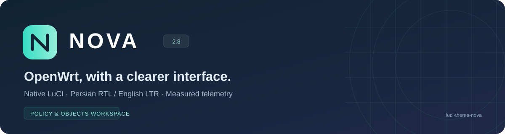

<p align="center">
  
</p>

# NOVA · OpenWrt, with a clearer interface

A bilingual **native LuCI theme** with Persian typography, English LTR layout, real interface telemetry and a policy-oriented firewall workspace. Not a mock dashboard or a replacement router API.

[فارسی](docs/README.fa.md) · [Install](docs/INSTALL.md) · [Release 2.8.1](docs/releases/v2.8.1.md) · [Verification](docs/VERIFICATION.md) · [Contributing](CONTRIBUTING.md)

## At a glance

| Area | What NOVA adds |
| --- | --- |
| Language | Persian RTL / English LTR, bundled Estedad fonts, native gettext catalogs |
| Firewall | Distinct traffic policies, DNAT, SNAT, zones/forwarding and address sets |
| Telemetry | Real RX/TX charts, per-interface comparison, RAM and one-minute load history |
| Native LuCI | Table/interface presentation, clearer controls and navigation |
| PassWall 2 | Navigation and Persian catalog integration; the plugin remains separate |
| Router footprint | Precompiled CSS, local fonts, no runtime Node.js or CDN |

## Compatibility first

Current package: **`luci-theme-nova-2.8.1-r1.apk`**, architecture `noarch`.

The tested environment is **OpenWrt 25.12.5 x86_64**, **LuCI openwrt-25.12 with ucode templates**, and **PassWall 2 26.9.16-r1**. `noarch` does not guarantee compatibility with other LuCI/firmware versions.

This APK is an **OpenWrt package, not an Android application**. It is not an IPK for `opkg`. PassWall 1, other firmware versions and physical wireless devices have not been runtime-verified.

## Installation

Back up router settings first. Install only on a compatible `apk`/ucode LuCI target.

1. Obtain the APK from a published project Release and compare its SHA-256 with that Release's checksum.
2. In LuCI, open **System → Software → Upload Package** and upload the APK. No SFTP is required.
3. If prompted, allow only this unsigned local package; do not disable signature checking globally.
4. Open **System → System → Language and Style**, select **NOVA** and **فارسی** or **English**, then **Save & Apply**.
5. Reload with **Ctrl+F5**.

If the APK is already in `/tmp`, the offline SSH installation is:

```sh
apk add --no-network --allow-untrusted /tmp/luci-theme-nova-2.8.1-r1.apk
/etc/init.d/uhttpd restart
```

**Project repository:** [iwdscorp/OpenWrt-NOVA](https://github.com/iwdscorp/OpenWrt-NOVA). The 2.8.1 package is built and locally installed; the GitHub Release is prepared but not published yet. Download links will be added after the uploaded release assets are verified.

See [installation and recovery](docs/INSTALL.md) before deployment.

## Firewall · Policy & Objects

The firewall screens are different tools, not four interchangeable tables:

- **Traffic policies:** source, destination, protocol/port, schedule, action and configured status.
- **Service publishing · DNAT:** external address/port → internal host/port.
- **Source translation · SNAT:** source match, actual outbound zone, destination and rewrite mode.
- **Zones & forwarding:** member networks, router input/output, within-zone forward, masquerade and configured one-way paths.
- **Address sets:** address family, match fields and explicit members.

Search, status filters and sequence/source-destination grouping change presentation only. The complete original LuCI form remains available under **Advanced editor / rule order**. Edit/Create invoke its original handlers; delete, clone and reordering remain in that editor.

Inspired by [FortiGate's policy views](https://docs.fortinet.com/document/fortigate/7.0.0/administration-guide/497952/policy-views-and-policy-lookup), adapted to OpenWrt's zone/UCI semantics. This is not a FortiGate engine or UTM suite. NAT `ACCEPT` means **do not rewrite**, not a traffic-allow rule. The list shows UCI configuration, not runtime hits or every rule generated by PassWall/scripts.

## Charts that measure real data

Interface RX/TX comes from byte-counter deltas and elapsed time. Charts offer 1/3/15-minute session windows, timestamp-based spacing, weighted averages, peaks and observed session volume. Separate device charts avoid presenting a misleading WAN/LAN/bridge sum.

History starts when the page opens; two samples are needed for a rate. Missing/reset samples create gaps rather than invented traffic. Memory trends and **one-minute system load** are included; load is not CPU utilization percent. Packet/drop counters are cumulative, not per-client or per-policy usage.

Motion respects reduced-motion preferences and can be disabled. These are page-session charts, not persistent daily/monthly accounting.

## Verification, without overclaiming

Confirmed locally: build/tests, native APK upgrade, three ucode template compiles, installed-file hash matches, 3,542 Persian translation forms and 3,548 English checks. Firewall/network/PassWall configuration hashes stayed unchanged during installation.

Five firewall views are covered in both languages by **code-only DOM tests**, using a read-only nine-rule VM fixture plus isolated synthetic cases. Native nodes, handlers and cell order are preserved.

**Not yet verified:** fresh rendered browser/mobile QA, live native modal/save/apply/reorder workflows, physical wireless devices and live VPN/subscription operation. Test fixtures are not screenshots or end-to-end proof. Current UI screenshots are intentionally omitted until captured and reviewed.

See the [capability matrix and evidence](docs/VERIFICATION.md).

## Development

Use Node.js 24 LTS and npm for development only:

```sh
npm ci
npm run build
npm test
```

On Windows use `npm.cmd` if PowerShell blocks `npm.ps1`. CSS and translation catalogs are prebuilt for the router. The repository includes a read-only build/test CI workflow; a successful local test does not imply that CI has run on GitHub.

For the APK build prerequisites and publication checklist, see [Releasing](docs/RELEASING.md).

## Licenses and attribution

NOVA-specific theme code: [MIT](LICENSE). LuCI-derived templates/translations: [Apache-2.0](LICENSE-LuCI). The included PassWall 2 translation component and merged catalog carry [GPL-3.0](LICENSE-PassWall). Fonts retain their own [Estedad](LICENSE-Estedad.txt) and [Vazirmatn](LICENSE-Vazirmatn.txt) OFL notices.

This is a **mixed-license distribution**, not an MIT-only bundle. See [translation provenance](TRANSLATION-NOTICE.txt). NOVA is an independent project and is not affiliated with OpenWrt, Fortinet or PassWall.
