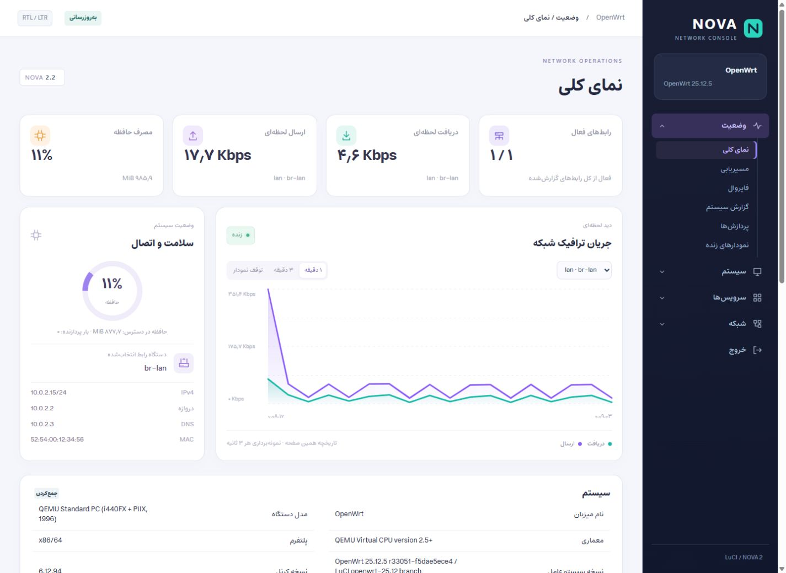

<div dir="rtl">

# مدیریت OpenWrt با ظاهری تازه

با NOVA، ظاهر LuCI بازطراحی می‌شود تا مدیریت شبکه، بررسی ترافیک و کار با فایروال منظم‌تر و خواناتر باشد. فونت فارسی استعداد، چیدمان راست‌به‌چپ و رابط انگلیسی چپ‌به‌راست، بخشی از این تجربه‌اند.

این قالب روی رابط اصلی OpenWrt کار می‌کند؛ فرم‌ها و سازوکار ذخیره و اعمال تنظیمات LuCI حفظ شده‌اند.

[English](../README.md) · [دانلود نسخهٔ ۲.۸.۱](https://github.com/iwdscorp/OpenWrt-NOVA/releases/tag/v2.8.1) · [راهنمای نصب و بازیابی](INSTALL.md) · [گزارش آزمون‌ها](VERIFICATION.md)

## نمای قالب



**تصویر واقعی از نسخهٔ ۲.۲:** این اسکرین‌شات از دموی محلی OpenWrt در QEMU ثبت شده و تصویر ساخته‌شده یا ماکاپ نیست. آخرین بستهٔ منتشرشده ۲.۸.۱ است و نمودارها و بخش فایروال از زمان ثبت این تصویر تغییر کرده‌اند؛ بنابراین تصویر، نمونه‌ای از طراحی قبلی است و ظاهر دقیق یا تأیید تصویری نسخهٔ فعلی را نشان نمی‌دهد.

## چه چیزی تغییر می‌کند؟

- **ظاهر و خوانایی:** جدول‌ها، تب‌ها و کنترل‌های LuCI با طراحی هماهنگ‌تر؛ فونت‌های همراه قالب، بدون نیاز به دریافت از اینترنت.
- **فارسی و انگلیسی:** ترجمهٔ فارسی و راست‌چین، در کنار رابط انگلیسی و چپ‌چین؛ با حفظ خوانایی آدرس‌های IP و نام‌های فنی.
- **فایروال:** نماهای مجزا برای قوانین ترافیک، انتقال پورت، تغییر آدرس مبدأ، ناحیه‌های شبکه و مجموعه‌های آدرس؛ همراه با جستجو و فیلتر.
- **پایش شبکه:** نمودار زندهٔ دریافت و ارسال، مقایسهٔ رابط‌های شبکه، روند مصرف حافظه و بار سیستم، بر پایهٔ داده‌های روتر.
- **PassWall 2:** هماهنگی ظاهر و ناوبری و ترجمهٔ فارسی برای افزونهٔ نصب‌شده. خود افزونه جداگانه نصب می‌شود.
- **اجرای محلی:** فایل‌های آمادهٔ CSS و فونت‌ها داخل بسته قرار دارند؛ روتر به Node.js یا سرویس CDN نیاز ندارد.

## دانلود و سازگاری

[دریافت بستهٔ نصب APK](https://github.com/iwdscorp/OpenWrt-NOVA/releases/download/v2.8.1/luci-theme-nova-2.8.1-r1.apk) · [دریافت کد منبع](https://github.com/iwdscorp/OpenWrt-NOVA/releases/download/v2.8.1/OpenWrt-NOVA-v2.8.1-source.zip) · [فایل بررسی صحت دانلود](https://github.com/iwdscorp/OpenWrt-NOVA/releases/download/v2.8.1/OpenWrt-NOVA-v2.8.1-SHA256SUMS.txt)

نسخهٔ فعلی **۲.۸.۱، پیش‌انتشار** است. محیط آزمایش‌شده:

- OpenWrt نسخهٔ `25.12.5` روی معماری `x86_64`.
- LuCI شاخهٔ `openwrt-25.12` با قالب‌های `ucode`.
- PassWall 2 نسخهٔ `26.9.16-r1`.

**این فایل APK، بستهٔ نرم‌افزاری OpenWrt است؛ برنامهٔ اندروید نیست.** برای روترهایی که از `opkg` و بستهٔ IPK استفاده می‌کنند مناسب نیست. برچسب `noarch` به‌تنهایی سازگاری با همهٔ نسخه‌های OpenWrt یا LuCI را تضمین نمی‌کند؛ نسخه‌های دیگر و PassWall 1 هنوز آزموده نشده‌اند.

اندازه و اثر انگشت SHA-256 فایل‌های منتشرشده با نسخه‌های محلی بررسی‌شده مطابقت دارند. آرشیو کد منبع مربوط به نسخهٔ تگ‌شده است؛ آخرین اصلاحات راهنماها را در شاخهٔ `main` ببینید.

## نصب از پنل روتر؛ بدون نیاز به SFTP

پیش از نصب، از تنظیمات روتر پشتیبان بگیرید و قالب قبلی را برای بازگشت نگه دارید.

1. بستهٔ APK و فایل بررسی صحت دانلود را از لینک‌های بالا دریافت کنید. مقدار SHA-256 بسته را با مقدار درج‌شده در آن فایل مقایسه کنید؛ روش انجام این کار در [راهنمای نصب](INSTALL.md) آمده است.
2. در LuCI، بخش «سامانه / بسته‌های نرم‌افزاری / بارگذاری بسته» را باز کنید و فایل APK را بارگذاری کنید. در رابط انگلیسی این مسیر **System / Software / Upload Package** است.
3. اگر گزینهٔ نصب بستهٔ محلی بدون امضا نمایش داده شد، فقط همین بسته را مجاز کنید. بررسی امضای بسته‌ها را به‌صورت سراسری غیرفعال نکنید. اگر این گزینه در رابط شما وجود ندارد، روش SSH در راهنمای نصب را دنبال کنید.
4. در «سامانه / سامانه / زبان و ظاهر» یا **System / System / Language and Style**، قالب **NOVA** و زبان **فارسی** یا **English** را انتخاب کنید و «ذخیره و اعمال» را بزنید.
5. صفحه را با **Ctrl+F5** دوباره بارگذاری کنید تا فایل‌های جدید قالب دریافت شوند.

اگر فایل APK را قبلاً به مسیر `/tmp` منتقل کرده‌اید، می‌توانید از طریق SSH نصب کنید:

</div>

```sh
apk add --no-network --allow-untrusted /tmp/luci-theme-nova-2.8.1-r1.apk
/etc/init.d/uhttpd restart
```

<div dir="rtl">

## آیا قالب با آپدیت از بین می‌رود؟

نوع آپدیت مهم است:

- **آپدیت خود NOVA:** فایل‌های نسخهٔ جدید جای فایل‌های قبلی را می‌گیرند. نصب بستهٔ فعلی فقط قالب و زبان‌ها را ثبت می‌کند؛ تنظیمات شبکه و فایروال را تغییر نمی‌دهد و انتخاب قالب یا زبان را تحمیل نمی‌کند. تغییرات دستی در فایل‌های قالب ممکن است بازنویسی شوند.
- **آپدیت LuCI:** معمولاً بستهٔ NOVA باقی می‌ماند، اما تغییر ساختار LuCI ممکن است سازگاری قالب را تحت تأثیر قرار دهد. سازگاری با نسخه‌ای خارج از محیط آزمایش‌شده را قطعی فرض نکنید.
- **ارتقای فریم‌ور OpenWrt:** در ارتقای معمول با تصویر رسمی، بسته‌هایی که جداگانه نصب کرده‌اید به‌طور پیش‌فرض حفظ نمی‌شوند؛ ممکن است لازم باشد NOVA را دوباره نصب کنید. گزینهٔ **Keep settings** برای نگه‌داشتن تنظیمات است، نه تضمین نگه‌داشتن فایل‌ها و خود بستهٔ قالب. [راهنمای رسمی OpenWrt](https://openwrt.org/docs/guide-user/installation/sysupgrade.packages)

پیش از ارتقای فریم‌ور، از تنظیمات پشتیبان بگیرید، فایل نصب قالب را روی کامپیوتر نگه دارید و موقتاً قالب **Bootstrap** را انتخاب کنید. بعد از ارتقا، سازگاری نسخهٔ جدید OpenWrt و LuCI را بررسی کنید؛ در صورت نیاز بستهٔ سازگار NOVA را نصب و دوباره انتخاب کنید، سپس **Ctrl+F5** بزنید. انتخاب Bootstrap فقط برای کاهش خطر اختلال در دسترسی به پنل است؛ بستهٔ NOVA را از حذف‌شدن در ارتقای فریم‌ور محافظت نمی‌کند.

ساخت یک فریم‌ور سفارشی که نسخهٔ سازگار NOVA را داخل خود داشته باشد، می‌تواند نیاز به نصب مجدد را برطرف کند؛ تضمین خودکارِ باقی‌ماندن قالب در همهٔ ارتقاها نیست. جزئیات بازگشت به قالب قبلی در [راهنمای نصب و بازیابی](INSTALL.md) آمده است.

## فایروال؛ هر بخش برای یک کار مشخص

نماهای فایروال بر اساس کاربرد از هم جدا شده‌اند:

| بخش | کاربرد |
| --- | --- |
| قوانین ترافیک | بررسی تصمیم عبور ترافیک بر اساس مبدأ، مقصد، پروتکل، پورت و زمان‌بندی |
| انتقال پورت — DNAT | هدایت اتصال ورودی به میزبان و پورت داخلی |
| تغییر آدرس مبدأ — SNAT | تنظیم بازنویسی آدرس مبدأ و ناحیهٔ خروجی |
| ناحیه‌ها و مسیرهای ارتباطی | نمایش شبکه‌های عضو، سیاست‌های ارتباط با روتر و مسیرهای یک‌طرفهٔ بین ناحیه‌ها |
| مجموعه‌های آدرس | مدیریت آدرس‌ها و مشخصات تطبیق مورد استفاده در قوانین |

«ویرایش» و «ایجاد» به فرم اصلی LuCI متصل‌اند. امکانات حذف، تکثیر، جابه‌جایی قوانین و تنظیمات عمومی در بخش «ویرایش پیشرفته / ترتیب قوانین» در دسترس‌اند. جستجو و گروه‌بندی فقط نمایش را تغییر می‌دهند؛ ترتیب اجرای قوانین دست‌نخورده می‌ماند.

طراحی این بخش از نماهای سیاست‌گذاری FortiGate الهام گرفته است، اما موتور فایروال همان OpenWrt است. در SNAT، مقدار `ACCEPT` به معنی «بدون بازنویسی آدرس» است، نه اجازهٔ عبور ترافیک. مجموعه‌های آدرس نیز به‌تنهایی مجوز دسترسی ایجاد نمی‌کنند.

این نما تنظیمات UCI را نشان می‌دهد؛ شمارندهٔ اجرای قوانین یا فهرست کامل قواعدی نیست که PassWall و اسکریپت‌ها در زمان اجرا تولید می‌کنند. قابلیت‌هایی مانند UTM و IPS به این قالب اضافه نشده‌اند.

## نمودارهای زنده؛ بر پایهٔ داده‌های روتر

سرعت دریافت و ارسال از اختلاف شمارندهٔ بایت و فاصلهٔ زمانی نمونه‌ها محاسبه می‌شود. تاریخچه با بازکردن صفحه آغاز می‌شود و در بازه‌های ۱، ۳ و ۱۵ دقیقه قابل بررسی است؛ پس از دریافت دو نمونه، اولین مقدار سرعت نمایش داده می‌شود.

نمودار هر رابط شبکه جداست تا ترافیک عبوری از LAN، WAN و پل شبکه چند بار به‌عنوان مصرف اینترنت شمرده نشود. اگر داده قطع شود یا شمارنده از نو شروع شود، آن فاصله به‌صورت شکاف نمایش داده می‌شود. تنظیم کاهش حرکت سیستم و امکان خاموش‌کردن انیمیشن‌ها نیز رعایت شده‌اند.

این نمودارها برای پایش همان جلسه‌اند، نه گزارش مصرف روزانه و ماهانه. «بار یک‌دقیقه‌ای سیستم» با درصد استفاده از پردازنده تفاوت دارد؛ شمارندهٔ بسته‌ها و افت‌ها هم گزارش مصرف هر کاربر یا هر قانون نیست.

## وضعیت آزمون‌ها و نسخهٔ پیش‌انتشار

ساخت و آزمون‌های کد، نصب و ارتقای APK در محیط محلی OpenWrt، کامپایل قالب‌ها، تطابق فایل‌های نصب‌شده و بررسی ترجمه‌ها موفق بوده‌اند. پنج نمای فایروال در هر دو زبان با آزمون‌های ساختار صفحه بررسی شده‌اند؛ تنظیمات شبکه، فایروال و PassWall هنگام نصب تغییر نکرده‌اند.

برای انتشار نهایی، بررسی تصویری تازهٔ مرورگر و موبایل، آزمون عملی ویرایش و ذخیره و اعمال تنظیمات، جابه‌جایی قوانین، تجهیزات بی‌سیم و اتصال VPN و اشتراک‌ها باقی مانده است. آزمون‌های کد، تأیید اجرای کامل این سناریوها نیستند. جزئیات در [گزارش آزمون‌ها و محدودیت‌ها](VERIFICATION.md) آمده است.

## توسعه و مشارکت

برای توسعه از Node.js 24 و npm استفاده کنید. وابستگی‌های توسعه روی کامپیوتر نصب می‌شوند، نه روتر:

</div>

```sh
npm ci
npm run build
npm test
```

<div dir="rtl">

اگر PowerShell اجرای npm را محدود می‌کند، از `npm.cmd` استفاده کنید. برای ساخت بسته، [راهنمای انتشار](RELEASING.md) و برای گزارش اشکال یا پیشنهاد تغییر، [راهنمای مشارکت](../CONTRIBUTING.md) را ببینید.

## مجوزها

کد اختصاصی NOVA با مجوز MIT ارائه شده است. اجزای مشتق از LuCI مجوز Apache-2.0 دارند؛ ترجمهٔ PassWall و کاتالوگ ادغام‌شده تابع GPL-3.0 هستند و فونت‌ها با مجوز OFL توزیع می‌شوند. هنگام بازنشر، مجوز و نام پدیدآورندگان هر بخش را حفظ کنید؛ کل بسته را نباید صرفاً دارای مجوز MIT معرفی کرد.

NOVA پروژه‌ای مستقل است و وابستگی رسمی به OpenWrt، Fortinet یا PassWall ندارد. [جزئیات منشأ ترجمه‌ها و مجوزها](../TRANSLATION-NOTICE.txt) در مخزن نگهداری می‌شود.

## رعایت حقوق پدیدآورندگان

NOVA با نام **تورانیو — [turanio.ir](https://turanio.ir)** ارائه می‌شود. لطفاً هنگام استفاده، کپی، تغییر یا بازنشر پروژه، حقوق پدیدآورندگان را رعایت کنید و اعلان‌های حق نشر، متن مجوزها و نام مشارکت‌کنندگان را حفظ کنید. در معرفی و اشتراک‌گذاری NOVA نیز نام تورانیو و نشانی پروژه را ذکر کنید.

حقوق اجزای شخص ثالث متعلق به صاحبان آن‌هاست و مجوز هر بخش باید رعایت شود. این یادداشت، مجوزهای موجود را تغییر نمی‌دهد و محدودیت تازه‌ای بر حقوقی که آن مجوزها اعطا می‌کنند اضافه نمی‌کند.

</div>
